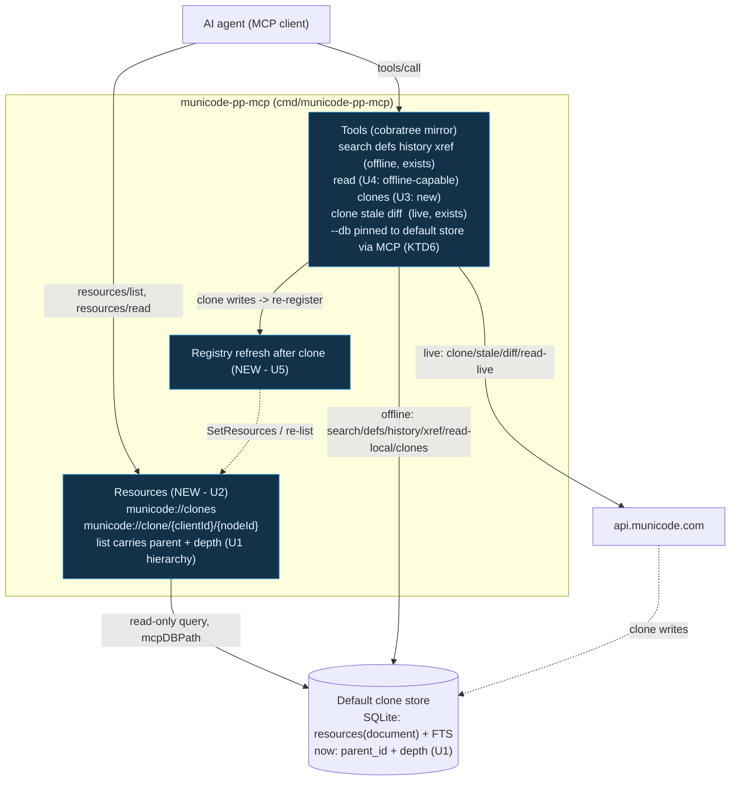

# feat: Local-clone MCP surface for AI interaction with cloned municipal codes

**Target repo:** municode (published as `Knit/municode`). All paths below are repo-relative to that project.

> Revised after a multi-persona doc review (coherence, feasibility, security, adversarial). Key changes: resource handlers query the store directly in package `mcp` (compile-boundary fix); the MCP surface is pinned to the default clone store (`--db` is CLI-only); clone now persists TOC hierarchy so resources are navigable; a unit was added to refresh the resource registry after an in-session clone; and generated-file hand-edits are routed through `.printing-press-patches/`.

## Summary

Give an AI agent a first-class way to work with a *locally cloned* city municipal code over MCP: **navigate** the cloned sections as MCP **resources** (with parent/depth hierarchy), read/inventory them **offline**, and refresh them **live** when needed. The CLI already ships an MCP server (`cmd/municode-pp-mcp`) that mirrors every Cobra command as a tool via `internal/mcp/cobratree`, so offline query tools (`search`, `defs`, `history`, `xref`) are already exposed. This plan fills the real gaps: no MCP resources, no persisted hierarchy to navigate by, no offline read-by-id or clone inventory, no in-session refresh of the resource list, and no discoverability of the clone-first workflow. Scope confirmed with the user: **extend the existing MCP** (not a new binary), **resources + tools**, **hybrid** (offline-first, but keep live clone/refresh tools). Pagination for very large codes remains deferred; the navigable list is validated at ~147 sections (Boulder, CO).

---

## Problem Frame

`municode-pp-cli clone "<City, ST>"` mirrors a city's code into a local SQLite store (`resources` table, `resource_type='document'`, FTS-indexed) — the durable artifact an AI should reason over without hitting `api.municode.com` on every question. Today the MCP surface only mirrors CLI commands as **tools**, so:

- An AI cannot **enumerate or navigate** what's in a clone — there is no resource listing, only imperative query tools. MCP clients that lean on `resources/list` + `resources/read` (the natural primitive for a document corpus) have nothing to consume, and the clone stores no parent/child structure to navigate by.
- `read` is **live-only** (`pp:data-source live`), so "read the exact section I just found" still calls the API even when the section sits in the clone.
- Nothing reports **which cities are cloned, at what codification version, or how fresh** — there is no inventory, so an agent can't decide whether to answer from the clone or refresh first.
- The mirror exposes **live and offline tools indistinguishably**, so an agent has no signal about the clone-first workflow (clone once → answer offline → refresh when stale).

The value of the clone (offline, stable, cite-able) is stranded behind a tool-only surface that doesn't expose it as navigable data.

---

## Requirements

- **R1** — Expose cloned sections as navigable MCP resources: a `resources/list` enumerating cloned sections (URI + human title + parent node-id + depth) and a `resources/read` returning a section's plaintext + citation.
- **R2** — Offline read of a specific section by node id from the clone, with no live API call when the section is present locally.
- **R3** — A clone inventory surface (tool + resource) reporting, per cloned city: state, client id, product id, codification version (`job_id`), section count, and last-synced timestamp.
- **R4** — Preserve the hybrid surface: the live `clone` / `stale` / `diff` tools remain available so an agent can create or refresh a clone.
- **R5** — Make the clone-first workflow discoverable to an agent (context/description naming: clone → offline query/navigate → stale/diff/refresh).
- **R6** — Offline operations (resources, `clones`, `read --data-source local`, `search`/`defs`/`history`/`xref`) must not perform live API calls when a clone exists.
- **R7** — The MCP surface (resources and MCP-invoked store tools) operates on the **default** clone store only; the CLI-local `--db` flag is not honored through MCP.
- **R8** — After an in-session `clone`, the resource list reflects the new clone within the same server session (no restart required).

**Success criteria:** Using only the MCP server, an agent can discover a cloned city, navigate its sections as resources (parent/depth), read/search/define/trace them offline (zero live calls), clone a new city and immediately see its sections in `resources/list`, detect that the local copy is behind upstream, and refresh it — end to end.

---

## Key Technical Decisions

- **KTD1 — Extend the existing MCP, don't add a second binary.** New offline commands are picked up automatically as tools by `internal/mcp/cobratree` (`RegisterAll` walks `cli.RootCmd()`); resources are registered alongside `RegisterTools` in `cmd/municode-pp-mcp/main.go`. Rationale: one binary, reuses the mirror + shellout infra, keeps tool and resource surfaces in sync with the CLI. (User-confirmed over a dedicated clone MCP.)
- **KTD2 — Resource handlers query the store directly *in package `mcp`*.** `internal/cli`'s store helpers (`mcStoredDoc`, `mcLoadCityDocs`, `mcSyncedCities`, `defaultDBPath`) are unexported and cannot be referenced from package `mcp`. Follow the existing `internal/mcp` precedent (`handleSearch`/`handleSQL`): open the store via `mcpDBPath()` and run `db.DB().QueryContext(...)` with a local doc struct — do **not** reuse the `cli` privates or export them. Rationale: compiles as written, matches the established pattern, and keeps the hand-authored `cli` API surface unchanged. (Corrects the original "reuse `mcStoredDoc`" direction, which would not compile.)
- **KTD3 — `read` becomes `--data-source` aware (auto|local|live), default auto.** `auto` serves from the clone when the section is present, else falls back to live; `local` is offline-only (missing → sync hint + empty); `live` is today's behavior. Rationale: satisfies R2/R6 without a new command, mirrors the framework `--data-source` convention. Client-id resolution in `local` mode comes from the synced store (no live `resolve` call). **Caveat:** `auto` silently falls back to a live call when a section is not local — the workflow guidance (U6) tells agents to pass `--data-source local` when a zero-live-call guarantee is required.
- **KTD4 — Inventory reads `synced_at` from the store, not the export manifest.** `clone --export` writes `clone-manifest.json`, but that's optional; every cloned row carries `synced_at` (an indexed column). The `clones` command and the `municode://clones` resource derive freshness from `MAX(synced_at)` per city so inventory works for any clone. Rationale: reliability over an opt-in artifact.
- **KTD5 — Hybrid stays tool-mediated; resources stay read-only.** Create/refresh (`clone`, `stale`, `diff`) remain live *tools* via the mirror; resources never mutate and never call the API. A single shared `renderStoredSection(...) -> {title, text, citation}` helper backs both the resource read and offline `read` so citation/HTML-strip logic cannot diverge. Rationale: clean capability boundary and one render path.
- **KTD6 — The MCP surface is pinned to the default clone store; `--db` is CLI-only (R7).** The command-local `--db` flag is not in `blockedRootFlags`, so through the mirror it would otherwise be an ordinary MCP tool parameter — letting an MCP client point SQLite's open at an arbitrary filesystem path (an unauthenticated primitive under `--transport http`). New/modified MCP-exposed store tools (`clones`, `read`) and all resource handlers resolve the DB via `mcpDBPath()`/`defaultDBPath()` only; `--db` is added to a per-command MCP-blocked-local-flags set (parallel to `blockedRootFlags`). Rationale: closes the arbitrary-file-open surface *and* guarantees the agent and the resource list always see the same store (no invisible `--db` clones). Consequence: a clone written to a non-default `--db` path is intentionally not visible via MCP.
- **KTD7 — Clone persists TOC hierarchy so resources are navigable.** The BFS walk in `clone` already knows each node's parent; persist `parent_id` and `depth` on each stored section so `resources/list` can emit a navigable tree signal (R1) rather than a flat title dump. Rationale: without hierarchy, a real code (thousands of sections) is enumerable but not navigable — "browse" would be an empty promise.

---

## High-Level Technical Design

The MCP server gains a resource surface beside its existing tool surface; both read the same default local clone store, the resource registry refreshes after an in-session clone, and the live tools remain for refresh.



Offline path (agent answering from a clone) touches only the store; the live path is reserved for creating or refreshing a clone. `resources/read` returns `TextResourceContents` (section plaintext + citation via the shared render helper); the `municode://clones` resource returns the same inventory JSON the `clones` tool emits, so both MCP client styles (resource-first and tool-first) get parity.

---

## Implementation Units

### U1. Persist TOC hierarchy during clone

**Goal:** Store `parent_id` and `depth` per cloned section so downstream resources can present a navigable tree (R1, KTD7).
**Requirements:** R1.
**Dependencies:** none (foundational).
**Files:**
- `internal/cli/clone.go` (modify — thread parent/depth through the BFS walk into each stored doc)
- `internal/cli/municode_store.go` (modify — add `parent_id`/`depth` to the stored-document shape and the load/scan helpers)
- `internal/cli/municode_store_test.go` (new or extend — round-trip + hierarchy assertions)

**Approach:** The clone BFS already visits parent→child; carry the parent node id and a depth counter and persist them on each stored section's JSON (`parent_id`, `depth`). Backward-compatible: existing clones without these fields decode to empty parent / depth 0 and still work (re-clone populates them). Keep the write path inside the existing store-upsert flow.

**Patterns to follow:** the existing BFS + upsert in `internal/cli/clone.go`; the stored-doc decode in `internal/cli/municode_store.go`.

**Test scenarios:**
- A cloned section's stored record carries the correct `parent_id` (its TOC parent) and `depth`.
- Root-level sections have empty/zero parent and depth 0.
- A record written before this change (no fields) decodes without error (empty parent, depth 0).
- `--json` output of a store read includes the new fields.

**Verification:** Cloned sections carry navigable parent/depth; a re-clone of an existing city populates them.

---

### U2. MCP resources for the cloned code

**Goal:** Expose cloned sections as navigable, readable MCP resources (R1, R6, R7).
**Requirements:** R1, R6, R7.
**Dependencies:** U1 (hierarchy fields).
**Files:**
- `cmd/municode-pp-mcp/main.go` (modify — add `server.WithResourceCapabilities(true, true)` to `NewMCPServer`; call the new `RegisterResources(s)`)
- `internal/mcp/resources.go` (new — resource registration + handlers, querying the store directly)
- `internal/mcp/resources_test.go` (new)

**Approach:** Register: (1) a static resource `municode://clones` whose handler returns the inventory JSON (shape shared with U3); (2) a resource **template** `municode://clone/{clientId}/{nodeId}` whose read handler loads that section from the store and returns `TextResourceContents` via the shared `renderStoredSection` helper (KTD5); (3) a `resources/list` enumerating every cloned section as a resource with `parent`+`depth` metadata for navigation. Per **KTD2**, handlers open the store directly in package `mcp` (`mcpDBPath()` + `db.DB().QueryContext`, local doc struct) — mirroring `handleSearch`/`handleSQL` — and bind `clientId`/`nodeId` as SQL `?` parameters (never string-interpolated). Per **KTD6**, the store path is `mcpDBPath()`/`defaultDBPath()` only. Missing/empty store → empty list, no error, no network.

**Technical design (directional, not a spec):**
```
municode://clones                         -> [{city, state, client_id, product_id, job_id, sections, last_synced}]
municode://clone/{clientId}/{nodeId}      -> "<title>\n\n<plaintext>\n\nSource: <citation>"   (renderStoredSection)
resources/list                            -> per cloned document: {uri, name=title, parent, depth, mimeType=text/plain}
```

**Patterns to follow:** `handleSearch`/`handleSQL` store access in `internal/mcp` (direct `QueryContext`, `mcpDBPath()`); mcp-go v0.47 resource API (`server.AddResource`, `server.AddResourceTemplate`, `mcp.NewResource`, `mcp.NewResourceTemplate`, handlers returning `[]mcp.ResourceContents`).

**Test scenarios:**
- `resources/list` on a populated clone returns one resource per section, each with title, `parent`, and `depth`, and a `municode://clone/{clientId}/{nodeId}` URI. Covers R1.
- `resources/read` of a valid URI returns the shared-render output (title + plaintext + citation), HTML-stripped.
- `resources/read` of a well-formed URI whose node is absent returns a not-found resource error, not a panic.
- `resources/list` against a missing/empty store returns an empty list, no error, and makes no network call (R6).
- `clientId`/`nodeId` containing SQL metacharacters are bound as parameters (no injection). Covers R7 boundary.
- `municode://clones` read returns the inventory array shape including `product_id` (parity with U3).
- The handler ignores any client-supplied `--db`; it always reads the default store (R7/KTD6).

**Verification:** An MCP client can list (with hierarchy) and read cloned sections; a clone-less environment lists nothing and never contacts the network or an alternate DB.

---

### U3. `clones` inventory command (offline)

**Goal:** Report what is cloned locally, at what version, and how fresh (R3, R6, R7).
**Requirements:** R3, R6, R7.
**Dependencies:** none. (U2's `municode://clones` resource reuses this unit's inventory shape.)
**Files:**
- `internal/cli/clones.go` (new — `newClonesCmd`)
- `internal/cli/clones_test.go` (new)
- `internal/cli/root.go` (modify — `rootCmd.AddCommand(newClonesCmd(flags))`)
- `internal/cli/municode_store.go` (modify — extend `mcSyncedCity`/`mcSyncedCities` to carry `product_id` and `last_synced` from `MAX(synced_at)`)

**Approach:** New `pp:data-source local` command `clones` listing each cloned municipality: `city`, `state`, `client_id`, `product_id`, `job_id`, `sections`, `last_synced`. Verify-friendly `RunE` (help-only branch, `dryRunOK`, missing-mirror guard → `[]` for `--json`/`--agent`, exit 0). Annotate `mcp:read-only`. The cobratree mirror auto-exposes it as an MCP tool. Per **KTD6**, add `--db` to the per-command MCP-blocked-local-flags set so the MCP tool always reads the default store. Extract the inventory builder into a helper the U2 resource handler can call.

**Patterns to follow:** `mcSyncedCities` in `internal/cli/municode_store.go`; verify-friendly `RunE` + missing-mirror guard in `internal/cli/defs.go` / `internal/cli/history.go`; the `mcp:read-only` annotation convention.

**Test scenarios:**
- Two cloned cities → both listed with correct `sections`, `product_id`, and `job_id`.
- `last_synced` present and parses as a timestamp.
- Empty/missing store → `[]` on stdout for `--json`, sync hint on stderr, exit 0 (R6).
- `--select client_id,job_id` narrows fields; `--json` array shape is stable.
- Field list matches the `municode://clones` resource exactly (parity guard with U2).

**Verification:** `municode-pp-cli clones --json` returns the inventory; the same data is reachable as the `municode_clones` MCP tool and the `municode://clones` resource.

---

### U4. Offline-capable `read`

**Goal:** Read a section by node id from the clone with no live call when present (R2, R6, R7).
**Requirements:** R2, R6, R7.
**Dependencies:** U1 (uses hierarchy-aware store read is optional; core is the offline lookup).
**Files:**
- `internal/cli/read.go` (modify — honor `--data-source auto|local|live`; flip `pp:data-source` from `live` to `auto`)
- `internal/cli/read_test.go` (new)
- `.printing-press-patches/` (new entry — the `read.go` annotation/behavior change is a hand-edit to a generated file; record it per AGENTS.md, see Risks)

**Approach:** Make `read` `--data-source` aware: in `local`/`auto`, resolve the city's `client_id` from the synced store (offline) and return the stored section for `<nodeId>` via the shared `renderStoredSection` helper (KTD5) if present; `local` with no clone → sync hint + empty, exit 0; `auto` falls back to the existing live fetch when not local; `live` unchanged. Per **KTD6**, `--db` is pinned to the default store when invoked via MCP.

**Execution note:** Start from a failing test asserting `read --data-source local` on a cloned node performs zero live calls and returns the stored text; it makes the offline/live branch boundary explicit.

**Patterns to follow:** `--data-source` handling in generated `internal/cli/search.go` (auto→local fallback); store lookup in `internal/cli/municode_store.go`; `renderStoredSection` (shared with U2).

**Test scenarios:**
- `read --data-source local` on a cloned node returns stored text with zero network (store-only fixture).
- `read --data-source local` on an uncloned city → sync hint + empty, exit 0 (R6).
- `read --data-source auto` on an uncloned city falls back to live and returns content.
- `read --data-source live` behaves exactly as before (regression guard).
- Cross-check: `read --local` and `resources/read` return identical text + citation for the same node (shared-render guard).

**Verification:** An agent reads an exact cloned section offline; `auto` still works for uncloned cities; the two offline-read surfaces agree.

---

### U5. Refresh the resource registry after an in-session clone

**Goal:** A city cloned during a live MCP session appears in `resources/list` without a server restart (R8).
**Requirements:** R8.
**Dependencies:** U2 (resource registration).
**Files:**
- `internal/mcp/resources.go` (modify — expose a re-list/refresh entry point)
- `cmd/municode-pp-mcp/main.go` (modify — invoke refresh after a mirror `clone` tool call completes, if a post-tool hook is available)
- `internal/mcp/resources_test.go` (extend)

**Approach:** mcp-go v0.47 builds `resources/list` from the static resource map populated at `RegisterResources` time, so a post-startup clone is otherwise invisible until restart. Provide a refresh that re-enumerates the store and re-registers (or `SetResources`) the current cloned-section set, and trigger it after the mirrored `clone` tool runs. If mcp-go exposes no post-tool hook, fall back to rebuilding the list on each `resources/list` request (a per-request store scan) rather than a cached snapshot. **Execution-time unknown:** which hook mcp-go v0.47 actually offers — confirm against the vendored library; the two viable shapes (post-tool refresh vs. dynamic list handler) are both acceptable.

**Test scenarios:**
- After a simulated in-session clone, `resources/list` includes the new city's sections without restarting the server (R8).
- The template read `municode://clone/{clientId}/{nodeId}` already works for a known id even before a list refresh (regression: reads don't depend on the list snapshot).
- Refresh is idempotent — repeated refreshes don't duplicate resources.

**Verification:** An agent can `clone` then immediately `resources/list` the new sections in one session.

---

### U6. Clone-workflow discoverability (context + framing)

**Goal:** Make the clone-first, hybrid workflow legible to an agent (R4, R5).
**Requirements:** R4, R5.
**Dependencies:** U2, U3, U4, U5 (so the described surface exists).
**Files:**
- `internal/mcp/tools.go` (modify — extend the `handleContext` description with the clone workflow and offline-vs-live tool split)
- `internal/cli/clones.go`, `internal/cli/read.go` (modify — `Long` help states "operates on the local clone" / offline semantics)
- `internal/mcp/intents.go` (optional — a named `browse_local_code` intent: clone-if-missing → list resources → read/search)
- `.printing-press-patches/` (new entries — `tools.go` `handleContext` and `read.go` edits are hand-edits to generated files; record each per AGENTS.md, see Risks)

**Approach:** Give the agent one authoritative description of the loop: `clone "<City, ST>"` once → answer with `search`/`read --data-source local`/`defs`/`history`/`xref` and the `municode://clone/...` resources (offline) → check freshness with `stale`, see changes with `diff`, refresh with `clone`. Surface it through the MCP `context` response and reinforce it in the offline commands' `Long` help so mirrored tool descriptions carry the same framing. Keep the live tools exposed (they already are).

**Test scenarios:**
- The `context` handler output includes the clone-first workflow guidance and distinguishes offline vs live tools (assert on the guidance substring).
- `clones` and `read` `--help` state the local-clone / offline semantics.
- **Behavioral proxy (reframed success criterion):** a scripted transcript in which an agent, given only the MCP `context`, selects an offline tool (`search`/`read --local`) before any live tool for a "what does the code say" question. If a behavioral harness is impractical, downgrade the unit's success criterion to "the clone-first guidance is present and discoverable" rather than claiming inferred agent behavior.

**Verification:** An agent reading only the MCP `context` and tool descriptions is steered to the clone-first workflow; the behavioral proxy (or the downgraded discoverability check) passes.

---

## Scope Boundaries

**In scope:** TOC-hierarchy persistence in `clone` (U1); MCP resources with navigation metadata (U2); offline `clones` inventory (U3); offline-capable `read` (U4); in-session resource refresh (U5); workflow discoverability + hybrid framing (U6). Reuse of existing offline tools (`search`/`defs`/`history`/`xref`) and live tools (`clone`/`stale`/`diff`) as-is. Pinning the MCP surface to the default store (KTD6).

### Deferred to Follow-Up Work
- **Resource pagination / cursoring** for very large codes (thousands of sections). The navigable list is validated at ~147 sections (Boulder, CO); if a large code makes the full list payload unwieldy — especially over `--transport http` — add cursoring before relying on it at scale.
- **MCP `listChanged` push notifications.** U5 makes an in-session clone appear on the next `resources/list`; proactively *notifying* subscribed clients that the list changed is out of scope.
- **Addressing a non-default `--db` clone via MCP.** By KTD6 the MCP surface intentionally sees only the default store; exposing alternate stores through MCP (with a safe path allowlist) is a separate decision.

### Non-goals
- No new upstream data sources or endpoints; no changes to the Printing Press generator.
- No mutation via resources; refresh stays an explicit live tool call.
- No auth layer for the HTTP transport (see Risks — pre-existing posture, unchanged here).

---

## Risks & Dependencies

- **Regen-mergeability of generated-file hand-edits (load-bearing).** `cmd/municode-pp-mcp/main.go`, `internal/mcp/tools.go`, and `internal/cli/read.go` are generator-emitted (`DO NOT EDIT`). This plan edits all three: the two-line `main.go` capability+register change (U2/U5), the `tools.go` `handleContext` extension (U6), and the `read.go` `--data-source`/annotation change (U4). Per `AGENTS.md` ("Hand-edits must be regen-mergeable"), **each generated-file edit must be recorded under `.printing-press-patches/`** so a future Printing Press regen re-applies it instead of silently dropping it. All net-new logic lives in new files (`internal/mcp/resources.go`, `internal/cli/clones.go`) to minimize generated-file surface.
- **`resources/list` snapshot semantics (addressed by U5).** mcp-go v0.47's list is built from a static map at registration time; without U5, in-session clones would be invisible until restart. U5's exact mechanism (post-tool refresh vs. dynamic list handler) is an execution-time unknown to confirm against the vendored library.
- **HTTP transport has no access control (pre-existing).** `cmd/municode-pp-mcp/main.go` already supports `--transport http` on `:7777` with no auth middleware; this plan adds surface onto that same server. KTD6 removes the arbitrary-`--db`-open primitive for the new/modified tools, but the broader "should the HTTP transport be network-reachable at all" question predates this plan and is not resolved here — flagged so it isn't mistaken for introduced-by-this-work.
- **Store-schema coupling.** Resources/inventory read the generic `resources` table shape directly (KTD2), now including the new `parent_id`/`depth` fields (U1); a future Printing Press store-schema reprint needs review of these handlers. Consistent with the CLI's existing novel-command coupling.
- **Client-id resolution offline.** `read --data-source local` maps "City, ST" → `client_id` from the synced store (a city not in the store is simply "not cloned"). Covered by U4 tests.

---

## Sources & Research

- Existing MCP surface: `internal/mcp/tools.go` (`RegisterTools`, `handleContext`, `handleSearch`/`handleSQL` store-access precedent, `mcpDBPath()`), cobratree mirror at `internal/mcp/cobratree/walker.go` (`RegisterAll`) + `shellout.go` (`blockedRootFlags`, `blockedStructuredArgsForCommand`), server construction in `cmd/municode-pp-mcp/main.go` (`NewMCPServer`, `--transport http`).
- Local store + access helpers: `internal/cli/municode_store.go` (`mcSyncedCities`, `mcLoadCityDocs`, `mcScanDocs`, `mcStoredDoc`), `internal/store/store.go` (`OpenReadOnlyContext`, `synced_at` column, DSN construction), `--db` flag on store-touching commands (`internal/cli/clone.go`).
- Offline/live split verified via `pp:data-source` annotations: offline `search`/`defs`/`history`/`xref`; live `read`/`toc`/`clone`/`stale`/`diff`.
- MCP library: `github.com/mark3labs/mcp-go v0.47.0` (tool + resource capabilities; static `resources/list` from the resource map).
- Regen-mergeability contract: `AGENTS.md` ("Local Customizations" / `.printing-press-patches/`).
- Doc review (2026-06-30): coherence, feasibility, security, adversarial personas — findings integrated above (package-boundary compile fix, field-parity, `--db` pinning, static-list refresh, hierarchy signal, regen capture, shared render helper, behavioral-proxy criterion).
- Prior run artifacts (design context): `~/printing-press/manuscripts/municode/`.
